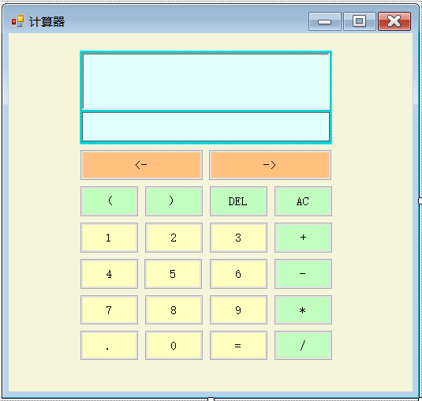
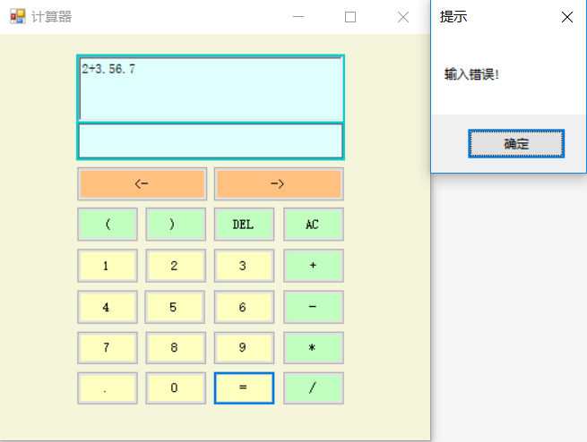

# **题目一：简单计算器**
## **一、项目名称**
这是一个简单的计算器程序，可以实现以下功能：
1. 支持四则运算和括号的运算。
2. 可以保存计算的历史纪录，并将记录存入指定路径的txt文件中，且重启后记录不会消失。
3. 有良好的人机交互界面。
4. 具有退格和清零的功能，还具有后退<-和前进->功能。

---
## **二、设计流程**
### 1、读懂题意，确定使用的工具。
人机交互界面用visual studio 2017中的windows窗体应用实现；四则运算和括号运算则需要先编写一个addComments函数，双击按钮时调用此函数，经上网查询括号运算的实现方法，还需调用js引擎加以实现；对于计算历史纪录的保存，则需用到Filestream将记录写入到txt中。
### 2、新建一个windows窗体应用，在前面板上确定好布局

### 3、项目需要用到js引擎，在引用中加入Microsoft.JScript库
在项目目录中右键单击[引用]，选择添加引用；在弹出框中选择程序集中的框架：Microsoft.JScript。
### 4、前期程序的准备
由于需用到Filestram，需添加头文件System.IO。
```C
int tab = 0;
//记录指针
int Precord = 0;
//记录数
int RecordNum = 0;
public String text = "";
//存储记录
public String[] record = new String[10];
//存储表达式
public String[] texts = new String[10000];
//加载js引擎
Microsoft.JScript.Vsa.VsaEngine ve = Microsoft.JScript.Vsa.VsaEngine.CreateEngine();
```
编号处理函数
```C
public void addComments(String s)
{
    this.text += s;
    this.texts[tab] = s;
    this.richTextBox1.Text = this.text;
    tab++;
}
```
### 5、编写各个数字、运算符按钮的触发事件函数
仅以部分的数字与运算符为例，按钮触发时，需调用前面编写的addComments处理函数。
```C
//1按钮的触发事件
private void button1_Click(object sender, EventArgs e)
{
    this.addComments("1");
}
//.(小数点)按钮的触发事件
private void button12_Click(object sender, EventArgs e)
{
    this.addComments(".");
}
//)按钮的触发事件
private void button17_Click(object sender, EventArgs e)
{
    this.addComments(")");
}
//+按钮的触发事件
private void button13_Click(object sender, EventArgs e)
{
    this.addComments("+");
}
```
### 6、编写存储数据的函数
```C
//写入txt的函数
public void Save_result(string p)
{
    FileStream fs = new FileStream(@"C:\Users\18081\Desktop\代码质量-课后作业\WindowsFormsApp3\memory.txt", FileMode.Append);
    //根据所需写入txt的具体位置修改文件路径
    byte[] data = new UTF8Encoding().GetBytes(p);
    fs.Write(data, 0, data.Length);
    fs.Flush();
    fs.Close();
}
```
### 7、编写=按钮的触发事件函数
运用js引擎计算得到结果，并显示到显示结果的文本框中；同时调用Save_result函数，将计算结果写入txt文件中。
```C
//=按钮的触发事件
private void button11_Click(object sender, EventArgs e)
{
    try
    {
        //就是结果
        String result = Microsoft.JScript.Eval.JScriptEvaluate(this.text, ve).ToString();
        Save_result(text);
        Save_result("=");
        Save_result(result);
        Save_result("\r\n");
        this.textBox1.Text = result;
        this.record[RecordNum] = this.text;
        this.text = result;
        this.RecordNum++;
        this.Precord = this.RecordNum;
    }
    catch (Exception)
    {
        MessageBox.Show("输入错误！","提示");
        this.text = "";
        tab = 0;
    }
}
```
### 8、编写退格、清零按钮的触发事件函数
```C
//清零按钮的触发事件
private void button20_Click(object sender, EventArgs e)
{
    this.text = "";
    this.richTextBox1.Text = this.text;
    this.textBox1.Text = this.text;
}
//退格按钮的触发事件
private void button19_Click(object sender, EventArgs e)
{
    if (tab > 0)
    {
        tab -= 1;
    }
    this.text = "";
    for (int i = 0; i < tab; i++)
    {
        this.text += this.texts[i];
    }

    this.richTextBox1.Text = this.text;
}
```
### 9、编写<-和->按钮的触发事件
仅以<-按钮为例
```C
//<-按钮的触发事件
private void button21_Click(object sender, EventArgs e)
{
    Precord--;
    if (Precord < 0)
    {
        Precord = RecordNum;
    }
    // this.text = this.record[Precord];
    this.richTextBox1.Text = this.record[Precord];
}
```

---
## 三、项目测试
### 1、 点击数字、运算符按钮输入计算式，点击等于按钮，可以在文本框中显示出正确的计算结果。计算优先级符合要求，括号运算符合要求。
### 2、 打开指定路径下的txt文件，可以看到文件中存储了之前的计算式和计算结果；重复上述过程，可以看到txt文件中之前的记录仍然存在，并添加了新的运算记录；重启程序后再进行计算，txt文件中之前的记录仍然存在，并添加了新的运算记录。

### 3、退格、清零、前进->、后退<-按钮功能均可以实现。
### 4、输入错误的表达式后，出现提示报错窗口。


---
## 四、项目使用
该项目可以作为windows用户的计算器使用，用户按照实际计算器的操作就可以在电脑上使用该计算器进行计算，这将给用户在电脑上的学习工作等方面带来诸多便利。

---
## 五、后期改进
可以在计算器上加入sin、cos、tan、ln等计算的功能，同时可以查询计算记录。这些功能可以在日后加以完成。

---
## 六、项目的贡献者
卢沁书

---
## 七、项目的作者
卢沁书、彭特、黄博、陈岑、张佑康、孔向豪